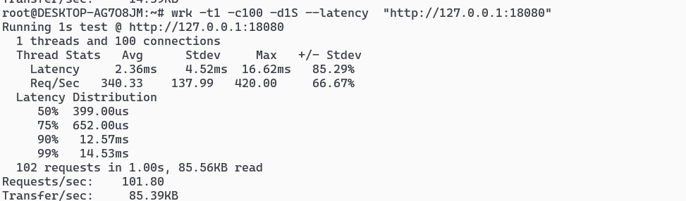

# wormhole
内网穿透工具

### 功能特性
将内网的端口映射到公网，从而达到内网穿透的目的

### 项目结构
* server 运行在公网的服务端，接受内网代理的连接，并把内网的端口映射到公网服务器上，客户端通过访问公网端口来访问内网服务
* proxy 运行在内网，与公网服务建立连接，发送配置，把来自公网的流量转发到内网服务
* serialize 提供公网服务与内网代理数据的序列化和反序列化功能

### 使用

1. 在公网服务器运行server
```shell
java -jar server-1.0.0-SNAPSHOT-jar-with-dependencies.jar --port 8090
```
* --port 接受内网代理连接请求的端口

2. 在内网服务器运行proxy
```shell
java -jar proxy-1.0.0-SNAPSHOT-jar-with-dependencies.jar --serverHost 127.0.0.1 --serverPort 8090 --configPath ./config.json
```
* --serverHost 公网服务的ip
* --serverPort 公网服务的端口
* --configPath 内网服务配置文件

3. 内网服务配置
```json
{
  "mysql": {
    "ip": "127.0.0.1",
    "port": "3306",
    "mappingPort": "3307"
  },
  "ssh": {
    "ip": "127.0.0.1",
    "port": "22",
    "mappingPort": "2200"
  }
}
```        
### 运行实例


### 性能测试


